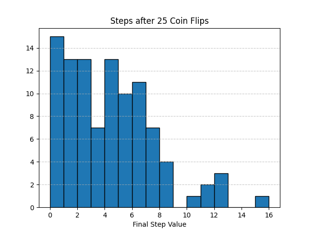
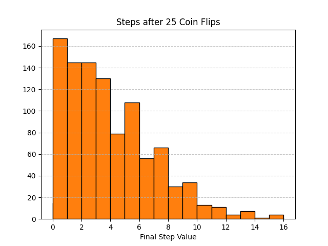
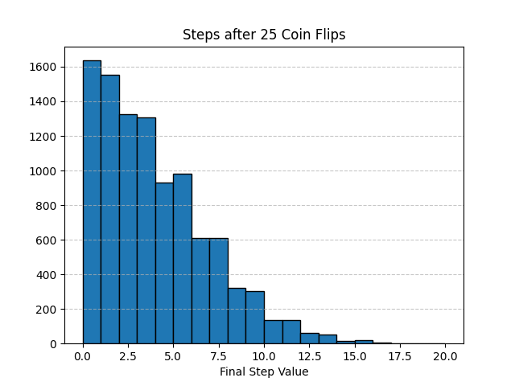

# Distribution

We saw in the chapter on random numbers that we can generate something called "random walk", which is the cumulative result of several sequencial random steps. But we only ran our dungeon crawl function once. The collection of random values led to a single outcome, but what would a new collection of random values produce? And what if we created a new collection of values multiple times? Running a single simulation isn't a very helpful way to determine is something works, but if we run it over and over and over again, we can get a better idea on how often we'll acheive a certain result by collecting every result and seeing how often we get what we want.

For a much simpler example, let's go back to the coin flips, heads goes forward, tails goes back. How often can 25 flips get you ten steps ahead?

```py
import numpy as np
import pandas as pd

np.random.seed(123)

def flip_coin():
    if np.random.randint(0, 2) > 0:
        return "heads"
    return "tails"

def coin_walk():
    flips = range(0, 25)
    step = 0
    path = {
        'steps': [],
        'sides': []
    }
    
    for flip in flips:
        side = flip_coin()
        
        if side == "heads":
            step += 1
            path['steps'].append(step)
            path['sides'].append(side)
        else:
            step = max(0, step -1)
            path['steps'].append(step)
            path['sides'].append(side)
            
    return pd.DataFrame(path)
```

We'll declare the seed again to make sure we get consistent data, and run coin_walk to see if we can get to 10 steps:

```py
print(coin_walk())

#     steps  sides
# 0       0  tails
# 1       1  heads
# 2       0  tails
# 3       0  tails
# 4       0  tails
# 5       0  tails
# 6       0  tails
# 7       1  heads
# 8       2  heads
# 9       1  tails
# 10      2  heads
# 11      3  heads
# 12      2  tails
# 13      3  heads
# 14      2  tails
# 15      3  heads
# 16      2  tails
# 17      3  heads
# 18      4  heads
# 19      3  tails
# 20      2  tails
# 21      1  tails
# 22      2  heads
# 23      3  heads
# 24      4  heads
```

Because our seed is static, no matter how many times we run this file, we'll always end up on step 4, never making it all the way. However, this only applies to the first time the function is executed. If you run the function twice within the same function, you'll get a different result the second time:

```py
print(coin_walk())

#     steps  sides
# ..  ...    ...
# 24      4  heads

print(coin_walk())

#     steps  sides
# ..  ...    ...
# 24      0  tails
```

Well that's even worse, but it's at least a different result. If we want to get a real idea of how realistic a process this is, we can run this process 100 times, and track each success:

```py
def success_rate():
    successes = 0
    
    for run in range(0, 100):
        df = coin_walk()
        final_step = df['steps'].iloc[-1] # the final value of the 'steps' column
        
        if final_step >= 10:
            successes += 1
            
    return f"{successes}% success rate"

print(success_rate()) # 7% success rate
```

This collection of final results is called a `distribution`, which lets us see the odds of accomplishing some kind of task that involves chance. We can see here that our coin flip process is actually very unlikely, given that we tried several times and only have a 7% success rate.

If we want to document the likelihood, we can go back to pyplot and create graphs to demonstrate the process:

```py
import matplotlib.pyplot as plt

def coin_walk_histogram():
    final_steps = []
    
    for run in range(0, 100):
        df = coin_walk()
        final_step = df['steps'].iloc[-1]
        final_steps.append(final_step)
        
    plt.hist(
        final_steps, 
        bins=range(min(final_steps), max(final_steps) +2), 
        edgecolor='black'
    )
    plt.title("Steps after 25 Coin Flips")
    plt.xlabel("Final Step Value")
    plt.grid(axis='y', linestyle='--', alpha=0.7)
    plt.savefig("coin_flips.png")
    
coin_walk_histogram()
```



Occasionally, you'll have a runaway success and make it well past the necessary 10 steps, but by and large, you won't make it all the way, with the majority of attempts leaving you all the way back at zero.

We can get even more granular by running the simulation 1000 times:

```py
def coin_walk_histogram2():
    final_steps = []
    
    for run in range(0, 1000):
        df = coin_walk()
        final_step = df['steps'].iloc[-1]
        final_steps.append(final_step)
        
    plt.hist(
        final_steps, 
        bins=range(min(final_steps), max(final_steps) +2), 
        edgecolor='black'
    )
    plt.title("Steps after 25 Coin Flips")
    plt.xlabel("Final Step Value")
    plt.grid(axis='y', linestyle='--', alpha=0.7)
    plt.savefig("coin_flips2.png")
    
coin_walk_histogram2()
```



And why not, let's get nuts:

```py
def coin_walk_histogram3():
    final_steps = []
    
    for run in range(0, 10000):
        df = coin_walk()
        final_step = df['steps'].iloc[-1]
        final_steps.append(final_step)
        
    plt.hist(
        final_steps, 
        bins=range(min(final_steps), max(final_steps) +2), 
        edgecolor='black'
    )
    plt.title("Steps after 25 Coin Flips")
    plt.xlabel("Final Step Value")
    plt.grid(axis='y', linestyle='--', alpha=0.7)
    plt.savefig("coin_flips3.png")
    
coin_walk_histogram3()
```



The more times we run the function, the more accurate a distribution we get, but by looking at the shape of each of the histographs, we can see that we figured out the general trend almost immediately.
